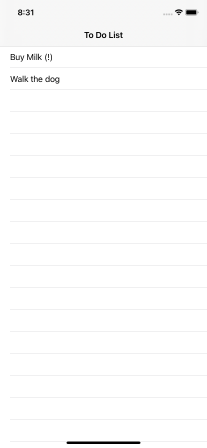

# Xamarin.iOS To-Do List

A basic example of an application on Xamarin.iOS. Built using Visual Studio for Mac - clone and go!

## Initial State

The current code model presents the following class (see [code here](./ToDoList/ToDoItem.cs) ):

```csharp
class Todo
{
    public string Name { get; set; }
    public bool Important {get; set; }
}
```

Here is what the application looks like running in the simulator (first checkpoint - just rendering the list):




