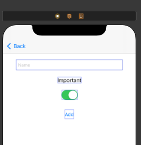

# Xamarin.iOS To-Do List

A basic example of an application on Xamarin.iOS. Built using Visual Studio for Mac - clone and go!

## Initial State

The current code model presents the following class (see [code here](./ToDoList/ToDoItem.cs) ):

```csharp
class Todo
{
    public string Name { get; set; }
    public bool Important {get; set; }
}
```

Here is what the application looks like running in the simulator (first checkpoint - just rendering the list):


## Adding Functionality

(see the blog post I wrote about this exploration for the full description of this - I only provided a summary for the purposes of this documentation).



Doing this and connecting the outlets and actions to the view controller generates the [designer file](./ToDoList/NewItemViewController.designer.cs).

The event handler for the Add button creates a new object (this is just the basic code - )

```csharp
partial void addButtonClicked(NSObject sender)
{

    if (!string.IsNullOrEmpty(nameTextField.Text))
    {
        var newItem = new ToDoItem
        {
            Name = nameTextField.Text,
            Important = importantSwitch.On
        };
    }
}

```

